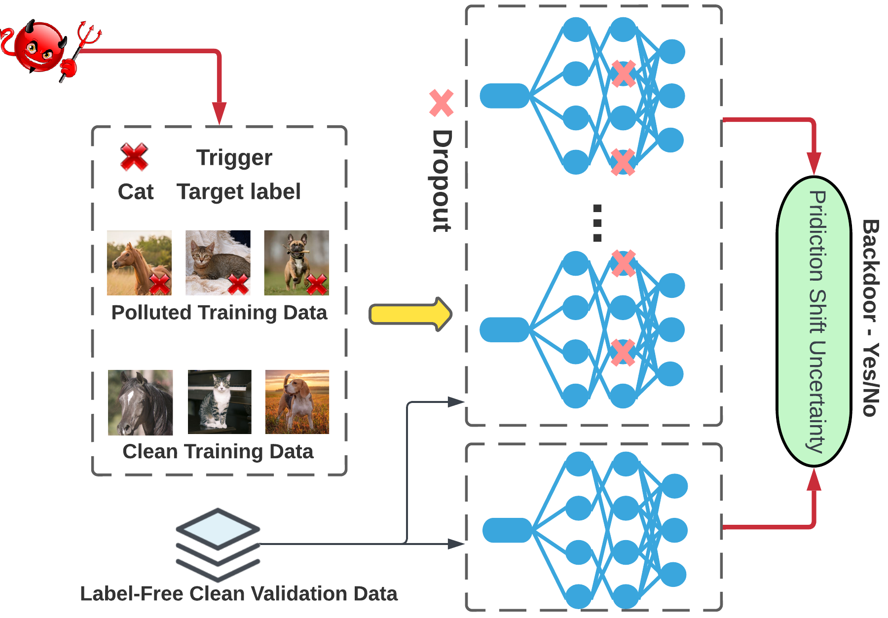

# PSBD: Prediction Shift Uncertainty Unlocks Backdoor Detection 
Official PyTorch Implementation of [PSBD: Prediction Shift Uncertainty Unlocks Backdoor Detection](https://arxiv.org/abs/2406.05826).
* There is still a lack of direct filtering methods for identifying suspicious training data to unveil potential backdoor samples.
* We propose a novel method, Prediction Shift Backdoor Detection (PSBD), leveraging an uncertainty-based approach requiring minimal unlabeled clean validation data.

* An overview of the PSBD framework.


## Environments
```bash
conda create -n PSBD python=3.11
conda activate PSBD

git clone https://github.com/WL-619/PSBD
cd PSBD
pip3 install -r requirements.txt
```

## Quick Start

### Data Download
- Original CIFAR-10 dataset would be automatically downloaded.

- To download and process the Tiny ImageNet dataset, you can use the script we provided by running `bash tiny_download_process.sh`. It will automatically save the dataset to the appropriate directory.

- We provide data for TrojanNN and ISSBA attacks on CIFAR-10 and Tiny ImageNet datasets, as well as Label-Consistent attack on the Tiny ImageNet dataset. All these data are sourced from the [BackdoorBench](https://github.com/SCLBD/BackdoorBench) repository, and you can download them from [OneDrive](https://1drv.ms/f/s!Ajixv2f3vMZfgQxLlGK26T5r5Qa1?e=3ldNAS).

The directory structure of the `poisoned_train_set` folder after downloading the above data should be:

```
poisoned_train_set
├── create_lc_on_tiny.py
├── create_poisoned_set_from_bench.py
├── create_poisoned_set.py
├── lc_cifar10.sh
├── process_bench_data.sh
├── cifar10
│   ├── cifar10_issba_0_1.zip
│   ├── cifar10_issba_0_05.zip
│   ├── cifar10_trojannn_0_1.zip
│   ├── cifar10_trojannn_0_05.zip
├── tiny
│   ├──tiny_issba_0_1.zip
│   ├──tiny_issba_0_05.zip
│   ├──tiny_trojannn_0_1.zip
│   ├──tiny_trojannn_0_05.zip
│   ├──tiny_lc_backdoor_train.zip
│   ├──tiny_lc_backdoor_test.zip
```

Please run the command `bash process_bench_data.sh` to process the downloaded data. The data will be automatically placed in the appropriate directories.
```bash
cd poisoned_train_set
bash process_bench_data.sh
```

### Create Label-Free Clean Extra Validation Data
Please initialize the label-free clean extra validation data using the following command before starting any experiments:
```bash
cd extra_val_set

python create_extra_val_set.py -dataset cifar10
python create_extra_val_set.py -dataset tiny
```

### Create Poisoned Training Data
Before launching `lc` attack on cifar10, run [poisoned_train_set/lc_cifar10.sh](/poisoned_train_set/lc_cifar10.sh).

Some examples for creating poisoned training data:
```bash
cd poisoned_train_set

python create_poisoned_set.py -dataset cifar10 -poison_type badnet -poisoning_ratio 0.1 
python create_poisoned_set.py -dataset tiny -poison_type badnet -poisoning_ratio 0.1

python create_poisoned_set.py -dataset cifar10 -poison_type blend -poisoning_ratio 0.1 -alpha 0.2
python create_poisoned_set.py -dataset tiny -poison_type blend -poisoning_ratio 0.1 -alpha 0.2

python create_poisoned_set.py -dataset cifar10 -poison_type wanet -poisoning_ratio 0.1 -cover_rate 0.2
python create_poisoned_set.py -dataset tiny -poison_type wanet -poisoning_ratio 0.1 -cover_rate 0.2

python create_poisoned_set.py -dataset cifar10 -poison_type lc -poisoning_ratio 0.1
python create_lc_on_tiny.py -adv_data_path './tiny/lc_backdoor_train/tiny_lc_train.npy' -poisoning_ratio 0.1

python create_poisoned_set.py -dataset cifar10 -poison_type adaptive_blend -poisoning_ratio 0.01 -cover_rate 0.01 -alpha 0.2
python create_poisoned_set.py -dataset tiny -poison_type adaptive_blend -poisoning_ratio 0.02 -cover_rate 0.02 -alpha 0.15

# Data from bench
python create_poisoned_set_from_bench.py -dataset cifar10 -poison_type trojannn -data_path './cifar10/trojannn_0_1/' -poisoning_ratio 0.1
python create_poisoned_set_from_bench.py -dataset tiny -poison_type trojannn -data_path './tiny/trojannn_0_1/' -poisoning_ratio 0.1

python create_poisoned_set_from_bench.py -dataset cifar10 -poison_type issba -data_path './cifar10/issba_0_1/' -poisoning_ratio 0.1
python create_poisoned_set_from_bench.py -dataset tiny -poison_type issba -data_path './tiny/issba_0_1/' -poisoning_ratio 0.1
```

### Train on Poisoned Data
After creating the poisoned training data, you can train the backdoor model with the following command:
```bash
cd training

python train_on_poison_set.py -dataset cifar10 -poison_type badnet -poisoning_ratio 0.1 -no_aug -no_normalize

# If the data from bench, please add -load_bench_data parameter
python train_on_poison_set.py -dataset cifar10 -poison_type trojannn -poisoning_ratio 0.1 -no_aug -no_normalize -load_bench_data

# Data augmentation during the model training was employed exclusively for Adaptive-Blend on CIFAR-10 and all experiments on Tiny ImageNet 
# to achieve an attack success rate exceeding 85%
python train_on_poison_set.py -dataset cifar10 -poison_type adaptive_blend -poisoning_ratio 0.01 -cover_rate 0.01 -alpha 0.2 -test_alpha 0.25 -no_normalize

python train_on_poison_set.py -dataset tiny -poison_type lc -poisoning_ratio 0.1 -no_normalize

python train_on_poison_set.py -dataset tiny -poison_type trojannn -poisoning_ratio 0.1 -no_normalize -load_bench_data
```

### Detect Backdoor Data
Once you have the trained backdoor model, you can utilize our PSBD and other detection methods to detect the backdoor data in the training dataset using the following command:
```bash
cd detection

# Our PSBD method
python psbd.py -dataset cifar10 -poison_type badnet -poisoning_ratio 0.1 -no_aug -no_normalize

# Baseline methods: scan, spectre, spectral_signature(ss), strip
python baseline_metric.py -dataset cifar10 -poison_type badnet -poisoning_ratio 0.1 -no_aug -no_normalize -baseline scan/
```

### Pilot Studies
To view the results of the pilot studies in our paper, run the following command. Please ensure you have the trained models before conducting the pilot studies.
```bash
cd pilot_study

# Pilot Study 1: MC-Dropout uncertainty (refer to our main paper for details)
python pilot.py -dataset cifar10 -poison_type badnet -poisoning_ratio 0.1 -no_aug -no_normalize

# Pilot Study 2: MC-Dropout uncertainty combined with input uncertainty (scaling up the image pixel values), as described in the appendix of our paper
python pilot.py -dataset cifar10 -poison_type badnet -poisoning_ratio 0.1 -no_aug -no_normalize -scale 3
```
### Train on Benign Data
You can also train the model on the benign dataset to exmaine the performance of clean model.
```bash
python train_on_benign_set.py -dataset cifar10 -no_aug -no_normalize

python train_on_benign_set.py -dataset tiny -no_normalize
```

## Citation
If you find our work to be useful for your research, please cite
```
@article{li2024psbd,
  title={PSBD: Prediction Shift Uncertainty Unlocks Backdoor Detection},
  author={Li, Wei and Chen, Pin-Yu and Liu, Sijia and Wang, Ren},
  journal={arXiv preprint arXiv:2406.05826},
  year={2024}
}
```